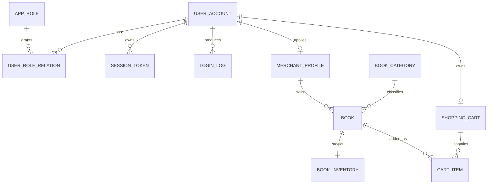

# 数据字典 V1

## 1. 文档信息

| 项目 | 内容 |
| --- | --- |
| 项目名称 | 在线书店电商系统 |
| 文档名称 | 数据字典 V1 |
| 文档定位 | 第 4 周需求基线正式材料；由第 3 周“数据对象清单 V0.1”升级而来，是第 7 周数据库设计的直接输入 |
| 业务场景 | 纸质书零售，服务普通读者、学生及藏书爱好者 |
| 架构前提 | 前后端分离；认证、鉴权、数据访问和敏感操作均由后端 API 校验；前端不得直连数据库 |
| 编制角色 | 数据库负责人 |
| 复核角色 | 后端负责人、安全负责人 |
| 版本状态 | V1 正式草案，待第 4 周需求评审确认 |
| 编制日期 | 2026-09-20 |
| 追溯依据 | 第 3 周功能需求清单 V1、安全与非功能需求清单 V1、角色权限清单、API 对象清单 V0.1、API 草案 V1 及第 4 周实践任务要求 |

本版覆盖用户管理核心对象和在线书店 P1 浏览、加购流程。订单、支付、退款、物流等对象属于 P2 预留范围，待 API 草案明确字段后再升级数据字典，不在 V1 中擅自固定字段，避免四份材料相互矛盾。

## 2. 适用范围与通用约定

### 2.1 本版范围

本版必须包含以下对象：

- P0 必交对象：用户、角色、用户角色关系、会话令牌、登录日志。
- 在线书店场景对象：商户档案、图书分类、图书、图书库存、购物车、购物车明细。
- 场景对象共 6 个，满足“本组场景对象不少于 2 个”的要求。

以下对象本版只保留边界，不定义字段：

| 预留对象 | 不展开原因 | 后续处理 |
| --- | --- | --- |
| 订单、订单明细 | API 草案 V1 将订单列为 P2，未冻结字段 | 第 5—7 周确认交易流程和接口后补充 |
| 支付记录、退款记录 | 真实支付留待项目 II；当前只要求说明安全边界 | 项目 II 或 API 冻结后补充 |
| 物流记录、售后记录 | 属项目 II 扩展范围 | 后续版本补充 |

### 2.2 命名与类型约定

1. 数据库表名和字段名统一使用小写 `snake_case`；API 使用 `camelCase`，映射关系见第 6 节。
2. 主键统一使用 `BIGINT UNSIGNED`；业务编号不得作为主键，数据库内部关联必须使用主键。
3. 时间统一保存为 UTC 的 `DATETIME(3)`；对外 API 按 ISO 8601 UTC 时间返回。
4. 金额使用 `DECIMAL(10,2)` 保存，币种使用 ISO 4217 三字母代码；API 中金额以字符串传输，避免浮点误差。
5. 布尔值使用 `TINYINT(1)`，只允许 `0` 或 `1`。
6. 状态、结果、类型字段优先使用 `VARCHAR` + `CHECK` 或应用层枚举，不使用含义不稳定的裸整数。
7. 逻辑删除使用 `deleted_at`；认证日志、审计记录原则上不做物理删除，按留存策略归档或匿名化。
8. 所有外键关系必须由数据库外键约束或等效事务约束保证；查询条件必须参数化，不得拼接用户输入。
9. 乐观锁字段统一为 `version INT UNSIGNED`，更新时校验版本，冲突时由后端重试或返回业务冲突。
10. 本节类型是逻辑数据字典的推荐物理映射；第 7 周确定具体数据库产品后，如需调整仅为物理类型，不改变字段语义和 API 映射。

### 2.3 敏感级别定义

| 级别 | 含义 | 存储要求 | 展示与日志要求 |
| --- | --- | --- | --- |
| S0 公开 | 可公开访问且无个人影响 | 明文存储 | 可展示；不得借字段推断内部实现 |
| S1 内部 | 仅限授权业务使用的内部数据 | 明文存储或按需加密 | 仅授权角色可见；日志只记录必要标识 |
| S2 个人信息 | 手机号、邮箱、地址、IP、设备信息等 | 加密存储或按安全策略脱敏存储 | 默认脱敏；禁止进入普通日志、异常和监控标签 |
| S3 认证与密钥材料 | 密码哈希、令牌哈希、密钥标识 | 单向哈希、加密或密钥管理系统保存 | 永不返回前端；永不写入日志；仅认证服务可访问 |
| S4 合规敏感 | 商户证照号等合规资料 | 字段级加密，密钥与业务库分离 | 默认掩码，仅授权审核人员按需查看脱敏结果 |

统一规则：

- `password_hash`、`token_hash`、加密密钥不得出现在 API 响应、日志、异常信息、链路标签或测试快照中。
- 手机号、邮箱的密文和 HMAC 指纹使用不同密钥；HMAC 密钥由 KMS 或密钥服务管理，不写入代码仓库和数据库。
- 手机号、邮箱即使由本人查询也按 API 草案 V1 脱敏展示，例如 `138****8000`、`r***g@example.com`。
- 管理员只能查看完成职责所必需的脱敏信息，不能查询明文密码、令牌或完整支付凭证。
- 商户只能访问本店图书、库存和履约所需数据；对象级归属必须由后端校验，不能信任前端传入的 `userId`、`merchantId` 或价格。
- 日志统一使用请求追踪编号 `trace_id`，不得以手机号、邮箱、令牌或密码作为日志标签。

### 2.4 角色与数据访问边界

| 数据对象 | 买家 | 商户 | 管理员 | 支付机构 |
| --- | --- | --- | --- | --- |
| 用户账号 | 仅本人最小资料 | 仅本人最小资料 | 授权范围内脱敏查询 | 禁止直接访问 |
| 角色与用户角色关系 | 只读本人生效角色 | 只读本人生效角色 | 授权范围内管理 | 禁止 |
| 会话令牌 | 只持有本次登录令牌，不能读取哈希 | 只持有本人令牌 | 不读取原始令牌；可执行安全处置 | 禁止 |
| 登录日志 | 禁止 | 禁止 | 授权范围内查询，不可修改或删除 | 禁止 |
| 商户档案 | 仅查看已审核店铺公开资料 | 仅本店 | 授权审核与管理 | 禁止 |
| 图书、分类、库存 | 只读公开在售数据 | 仅本店维护 | 审核、下架、处置违规内容 | 禁止修改 |
| 购物车明细 | 仅本人 | 不提供 | 禁止无授权查询 | 禁止 |

## 3. 数据对象总览

| 对象编号 | 表名 | 中文名 | 用途 | 关键归属字段 | 主要关联 API |
| --- | --- | --- | --- | --- | --- |
| DO-USER-001 | `user_account` | 用户账号 | 保存买家、商户、管理员登录身份和账号状态 | `user_id` | API-USER-001、API-AUTH-001、API-USER-002、API-USER-003 |
| DO-ROLE-001 | `app_role` | 角色 | 定义内部角色和外部系统角色的权限身份 | `role_id` | 角色鉴权、API-AUTH-001 |
| DO-ROLE-002 | `user_role_relation` | 用户角色关系 | 记录账号与角色的授权关系及有效期 | `user_id`、`role_id` | API-AUTH-001、授权管理 |
| DO-AUTH-001 | `session_token` | 会话令牌 | 保存可撤销登录会话和令牌摘要 | `user_id` | API-AUTH-001、API-AUTH-002 |
| DO-AUTH-002 | `login_log` | 登录日志 | 记录登录结果、失败原因和追踪编号 | `user_id`（可为空） | API-AUTH-001 |
| DO-SHOP-001 | `merchant_profile` | 商户档案 | 保存商户审核与店铺经营主体信息 | `merchant_id`、`user_id` | 商户注册审核；V1 预留 |
| DO-BOOK-001 | `book_category` | 图书分类 | 维护图书分类层级和展示顺序 | `category_id` | API-BOOK-001 |
| DO-BOOK-002 | `book` | 图书 | 保存图书公开信息、售价和销售状态 | `book_id`、`merchant_id` | API-BOOK-001、API-BOOK-002 |
| DO-BOOK-003 | `book_inventory` | 图书库存 | 保存本店图书可售、占用和安全库存 | `inventory_id`、`book_id` | API-BOOK-002、API-CART-002 |
| DO-CART-001 | `shopping_cart` | 购物车 | 表示一个买家的当前购物车 | `cart_id`、`user_id` | API-CART-001、API-CART-002 |
| DO-CART-002 | `cart_item` | 购物车明细 | 保存买家加入购物车的图书和数量 | `cart_item_id`、`cart_id`、`book_id` | API-CART-001、API-CART-002 |

## 4. 字段级数据字典

### 4.1 DO-USER-001：用户账号（`user_account`）

**用途：**保存登录身份、认证材料、联系方式密文、账号状态和登录保护状态。注册时默认创建买家账号，商户和管理员角色由受控授权流程产生。

**主键与唯一约束：**

- 主键：`user_id`。
- 唯一：`username`。
- 唯一：`phone_hash`；`email_hash` 在同一邮箱值存在时唯一。
- 普通索引：`status`、`created_at`、`last_login_at`。

**生命周期：**账号注销后先禁用并撤销全部会话，再按留存策略匿名化；不得直接物理删除仍被订单、审计或法务要求引用的账号。

| 字段名 | 中文名 | 类型 | 必填/可空 | 默认值与约束 | API 字段 | 敏感级 | 存储与展示方式 |
| --- | --- | --- | --- | --- | --- | --- | --- |
| `user_id` | 用户主键 | `BIGINT UNSIGNED` | 必填 | 自增或雪花 ID；不可修改 | `userId` | S1 | 内部标识；只返回本人或授权对象 |
| `username` | 登录名 | `VARCHAR(32)` | 必填 | 4—32 位，正则 `^[A-Za-z0-9_]+$`，唯一 | `username` | S1 | 明文存储；本人可见；高权限后台按最小范围可见 |
| `password_hash` | 密码哈希 | `VARCHAR(255)` | 必填 | 使用 Argon2id 或等价加盐不可逆算法 | 不返回 | S3 | 仅认证服务可读写；永不展示；日志、异常、响应均不得出现 |
| `password_algo` | 密码算法标识 | `VARCHAR(32)` | 必填 | 例如 `argon2id-v1` | 不返回 | S3 | 用于算法迁移；仅安全服务可访问 |
| `password_changed_at` | 密码修改时间 | `DATETIME(3)` | 必填 | 注册或最近修改密码时写入 | 不返回 | S1 | 内部时间；可用于撤销旧会话 |
| `phone_ciphertext` | 手机号密文 | `VARBINARY(256)` | 必填 | AES-GCM 字段级加密；随机 nonce 与认证标签一并保存 | `phone` | S2 | 仅在服务端解密；API 固定返回脱敏值，例如 `138****8000` |
| `phone_hash` | 手机号指纹 | `CHAR(64)` | 必填 | HMAC-SHA-256；用于唯一性和登录查找；密钥不得入库 | 不返回 | S3 | 仅认证与账号服务可查询；永不展示原始值 |
| `email_ciphertext` | 邮箱密文 | `VARBINARY(512)` | 可空 | AES-GCM 字段级加密 | `email` | S2 | 仅在服务端解密；API 返回脱敏邮箱 |
| `email_hash` | 邮箱指纹 | `CHAR(64)` | 可空 | HMAC-SHA-256；有邮箱时唯一 | 不返回 | S3 | 仅账号服务可查询；不写日志 |
| `nickname` | 昵称 | `VARCHAR(32)` | 可空 | 长度 1—32；去除首尾空白 | `nickname` | S2 | 本人可修改；其他角色仅在业务需要时可见 |
| `avatar_url` | 头像地址 | `VARCHAR(512)` | 可空 | 只允许受控 CDN 或对象存储地址 | 不返回 | S2 | 内部保存；公开前应经内容安全检查 |
| `status` | 账号状态 | `VARCHAR(16)` | 必填 | `active`、`locked`、`disabled`；默认 `active` | `status` | S1 | 状态可返回本人；变更必须审计并撤销相关会话 |
| `failed_login_count` | 连续失败次数 | `SMALLINT UNSIGNED` | 必填 | 默认 `0`；成功登录后清零 | 不返回 | S3 | 仅认证服务可读写；不得向客户端泄露锁定细节 |
| `locked_until` | 锁定截止时间 | `DATETIME(3)` | 可空 | 达到失败阈值时写入；到期后允许重试 | 不返回 | S3 | 仅认证服务可读写；登录失败统一提示账号或密码错误 |
| `last_login_at` | 最近登录时间 | `DATETIME(3)` | 可空 | 登录成功后更新 | `lastLoginAt` | S1 | 只返回本人；可用于账号安全提示 |
| `created_at` | 创建时间 | `DATETIME(3)` | 必填 | 服务端写入；不可修改 | `createdAt` | S1 | 本人及授权管理角色可见 |
| `updated_at` | 更新时间 | `DATETIME(3)` | 必填 | 服务端自动更新 | 不返回 | S1 | 仅内部使用 |
| `deleted_at` | 注销时间 | `DATETIME(3)` | 可空 | 未注销为空；逻辑注销时写入 | 不返回 | S1 | 删除流程需审计；非授权角色不可见 |

### 4.2 DO-ROLE-001：角色（`app_role`）

**用途：**定义买家、商户、管理员及外部支付机构的权限身份。外部支付机构不使用普通用户登录接口，其角色记录只用于内部授权模型和接口凭证治理。

**主键与唯一约束：**

- 主键：`role_id`。
- 唯一：`role_code`。
- 普通索引：`role_type`、`status`。

| 字段名 | 中文名 | 类型 | 必填/可空 | 默认值与约束 | API 字段 | 敏感级 | 存储与展示方式 |
| --- | --- | --- | --- | --- | --- | --- | --- |
| `role_id` | 角色主键 | `BIGINT UNSIGNED` | 必填 | 主键；不可修改 | 不直接返回 | S1 | 内部标识；授权管理接口可使用 |
| `role_code` | 角色编码 | `VARCHAR(32)` | 必填 | `buyer`、`merchant`、`admin`、`payment_agency`；唯一 | `role` | S1 | 对普通用户只返回其主业务角色；外部角色不经用户接口返回 |
| `role_name` | 角色名称 | `VARCHAR(64)` | 必填 | 与角色编码对应；可本地化 | 不直接返回 | S0 | 前端可按编码映射显示 |
| `role_type` | 角色类型 | `VARCHAR(16)` | 必填 | `internal`、`external_system` | 不返回 | S0 | 用于区分人员账号和外部系统 |
| `description` | 角色说明 | `VARCHAR(255)` | 可空 | 描述职责边界 | 不返回 | S0 | 仅管理端展示 |
| `status` | 角色状态 | `VARCHAR(16)` | 必填 | `active`、`disabled`；默认 `active` | 不返回 | S1 | 禁用后新授权立即失效，旧关系按流程撤销 |
| `is_system` | 是否系统内置 | `TINYINT(1)` | 必填 | 默认 `0`；系统角色不可删除 | 不返回 | S1 | 仅授权管理端可读 |
| `created_at` | 创建时间 | `DATETIME(3)` | 必填 | 服务端写入 | 不返回 | S1 | 审计字段 |
| `updated_at` | 更新时间 | `DATETIME(3)` | 必填 | 服务端自动更新 | 不返回 | S1 | 审计字段 |

### 4.3 DO-ROLE-002：用户角色关系（`user_role_relation`）

**用途：**记录用户与角色的显式授权关系、主角色标志、有效期和撤销信息。一个账号原则上绑定一个主业务角色；多角色必须显式授权并逐次鉴权。

**主键与唯一约束：**

- 主键：`user_role_id`。
- 唯一：`(user_id, role_id)`。
- 唯一/事务约束：同一 `user_id` 最多一条 `is_primary = 1 AND status = 'active'` 的关系。
- 外键：`user_id -> user_account.user_id`，`role_id -> app_role.role_id`。
- 索引：`(user_id, status)`、`(role_id, status)`。

| 字段名 | 中文名 | 类型 | 必填/可空 | 默认值与约束 | API 字段 | 敏感级 | 存储与展示方式 |
| --- | --- | --- | --- | --- | --- | --- | --- |
| `user_role_id` | 关系主键 | `BIGINT UNSIGNED` | 必填 | 主键 | 不返回 | S1 | 内部标识 |
| `user_id` | 用户主键 | `BIGINT UNSIGNED` | 必填 | 外键；不可修改 | 不返回 | S1 | 仅授权管理服务可访问 |
| `role_id` | 角色主键 | `BIGINT UNSIGNED` | 必填 | 外键；不可修改 | 不返回 | S1 | 仅授权管理服务可访问 |
| `is_primary` | 是否主业务角色 | `TINYINT(1)` | 必填 | 默认 `0`；每个用户最多一个有效主角色 | 用于生成 `role` | S1 | 返回角色编码，不返回关系主键 |
| `status` | 授权状态 | `VARCHAR(16)` | 必填 | `active`、`revoked`、`expired`；默认 `active` | 不返回 | S1 | 授权管理端展示变更历史 |
| `assigned_by` | 授权操作人 | `BIGINT UNSIGNED` | 可空 | 外键；系统初始化可为空 | 不返回 | S1 | 仅审计与授权管理端可见 |
| `assigned_at` | 授权时间 | `DATETIME(3)` | 必填 | 服务端写入 | 不返回 | S1 | 审计字段 |
| `expires_at` | 授权失效时间 | `DATETIME(3)` | 可空 | 为空表示长期有效 | 不返回 | S1 | 到期自动视为失效 |
| `revoked_at` | 撤销时间 | `DATETIME(3)` | 可空 | 撤销时写入 | 不返回 | S1 | 记录并审计 |
| `reason` | 授权或撤销原因 | `VARCHAR(255)` | 可空 | 高风险授权必须填写 | 不返回 | S1 | 仅审计管理端可见 |
| `created_at` | 创建时间 | `DATETIME(3)` | 必填 | 服务端写入 | 不返回 | S1 | 审计字段 |
| `updated_at` | 更新时间 | `DATETIME(3)` | 必填 | 服务端自动更新 | 不返回 | S1 | 审计字段 |

### 4.4 DO-AUTH-001：会话令牌（`session_token`）

**用途：**保存服务端可撤销会话。登录成功后只向客户端返回高熵原始令牌，数据库只保存摘要；退出、封禁、密码修改和风险处置时立即使相关会话失效。

**主键与唯一约束：**

- 主键：`session_token_id`。
- 唯一：`token_hash`。
- 外键：`user_id -> user_account.user_id`。
- 索引：`(user_id, revoked_at, expires_at)`、`expires_at`。

| 字段名 | 中文名 | 类型 | 必填/可空 | 默认值与约束 | API 字段 | 敏感级 | 存储与展示方式 |
| --- | --- | --- | --- | --- | --- | --- | --- |
| `session_token_id` | 会话主键 | `BIGINT UNSIGNED` | 必填 | 主键 | 不返回 | S1 | 内部标识 |
| `user_id` | 用户主键 | `BIGINT UNSIGNED` | 必填 | 外键；不可修改 | 不返回 | S1 | 仅认证服务可访问 |
| `token_hash` | 令牌摘要 | `CHAR(64)` | 必填 | SHA-256/HMAC-SHA-256；唯一；原始令牌不得入库 | 间接对应 `accessToken` | S3 | 只保存摘要；永不展示；退出后标记撤销 |
| `token_family_id` | 令牌族编号 | `CHAR(36)` | 必填 | UUID；用于刷新令牌轮换和盗用检测 | 不返回 | S3 | 仅认证服务可访问 |
| `issued_at` | 签发时间 | `DATETIME(3)` | 必填 | 服务端写入 | 对应 `expiresIn` 起点 | S1 | 仅认证服务可访问 |
| `expires_at` | 过期时间 | `DATETIME(3)` | 必填 | 必须晚于 `issued_at`；建议 2 小时，范围 5 分钟—24 小时 | 对应 `expiresIn` | S1 | 不返回精确内部时间，只返回剩余秒数 |
| `last_seen_at` | 最近使用时间 | `DATETIME(3)` | 可空 | 服务端按限流频率更新 | 不返回 | S1 | 仅安全审计使用 |
| `revoked_at` | 撤销时间 | `DATETIME(3)` | 可空 | 退出、封禁、改密或风险处置时写入 | 不返回 | S1 | 退出接口成功后必须立即写入 |
| `revoke_reason` | 撤销原因 | `VARCHAR(64)` | 可空 | `logout`、`disabled`、`password_changed`、`risk` 等 | 不返回 | S1 | 仅审计角色可见 |
| `client_ip` | 客户端 IP | `VARBINARY(16)` | 可空 | 只保存规范化地址；不得作为业务授权依据 | 不返回 | S2 | 仅安全服务可见；管理端默认掩码，不写普通日志 |
| `user_agent` | 客户端标识 | `VARCHAR(512)` | 可空 | 截断保存，不得超过 512 字符 | 不返回 | S2 | 仅安全审计使用；默认不展示完整内容 |
| `created_at` | 创建时间 | `DATETIME(3)` | 必填 | 服务端写入 | 不返回 | S1 | 审计字段 |

### 4.5 DO-AUTH-002：登录日志（`login_log`）

**用途：**记录登录成功、失败、锁定和风险拒绝结果，用于暴力破解检测、审计和问题追踪。日志只记录必要标识，不记录密码、原始令牌或完整账号。

**主键与索引：**

- 主键：`login_log_id`。
- 外键：`user_id` 可空关联 `user_account.user_id`；账号不存在时不得写入原始账号。
- 索引：`(user_id, created_at)`、`(result, created_at)`、`trace_id`、`(client_ip, created_at)`。

| 字段名 | 中文名 | 类型 | 必填/可空 | 默认值与约束 | API 字段 | 敏感级 | 存储与展示方式 |
| --- | --- | --- | --- | --- | --- | --- | --- |
| `login_log_id` | 日志主键 | `BIGINT UNSIGNED` | 必填 | 主键 | 不返回 | S1 | 仅审计服务可访问 |
| `user_id` | 用户主键 | `BIGINT UNSIGNED` | 可空 | 账号存在时写入；不得用前端传入值代替认证结果 | 不返回 | S1 | 仅授权审计查询可见 |
| `account_ref_hash` | 账号引用摘要 | `CHAR(64)` | 可空 | HMAC-SHA-256；仅在无法解析用户时用于聚合检测 | 不返回 | S3 | 仅安全服务可查询；永不展示 |
| `account_masked` | 账号脱敏值 | `VARCHAR(64)` | 可空 | 如 `138****8000` 或用户名脱敏结果 | 不返回 | S2 | 仅审计管理端按最小范围展示 |
| `result` | 登录结果 | `VARCHAR(16)` | 必填 | `success`、`failure`、`locked`、`blocked` | 不返回 | S1 | 聚合展示；不得据此泄露账号存在性 |
| `failure_code` | 失败原因编码 | `VARCHAR(32)` | 可空 | `INVALID_CREDENTIALS`、`ACCOUNT_LOCKED`、`ACCOUNT_DISABLED`、`RATE_LIMITED` | 不返回 | S1 | 内部审计使用；对外统一错误文案 |
| `client_ip` | 客户端 IP | `VARBINARY(16)` | 可空 | 规范化地址；不得作为唯一身份 | 不返回 | S2 | 安全服务可见；普通界面默认掩码 |
| `user_agent` | 客户端标识 | `VARCHAR(512)` | 可空 | 截断保存 | 不返回 | S2 | 仅安全审计使用 |
| `trace_id` | 追踪编号 | `VARCHAR(64)` | 必填 | 与接口响应 `traceId` 关联；唯一或可重复索引 | 不返回 | S1 | 审计服务可见；不得绑定手机号、令牌等敏感值 |
| `created_at` | 发生时间 | `DATETIME(3)` | 必填 | 服务端写入；不可修改 | 不返回 | S1 | 日志留存到期后匿名化或归档 |

### 4.6 DO-SHOP-001：商户档案（`merchant_profile`）

**用途：**保存已审核商户的经营主体、证照密文和审核状态。商户数据必须以 `merchant_id` 为对象级隔离边界，禁止跨店访问。

**主键与唯一约束：**

- 主键：`merchant_id`。
- 唯一：`user_id`。
- 外键：`user_id -> user_account.user_id`，`audited_by -> user_account.user_id`。
- 索引：`audit_status`、`status`。

| 字段名 | 中文名 | 类型 | 必填/可空 | 默认值与约束 | API 字段 | 敏感级 | 存储与展示方式 |
| --- | --- | --- | --- | --- | --- | --- | --- |
| `merchant_id` | 商户主键 | `BIGINT UNSIGNED` | 必填 | 主键；进入所有本店资源归属条件 | 不直接返回 | S1 | 授权服务可见；前端不得通过修改该值越权 |
| `user_id` | 商户账号 | `BIGINT UNSIGNED` | 必填 | 外键；唯一；一个商户账号对应一个商户档案 | 不返回 | S1 | 仅商户本人与授权管理端可见 |
| `store_name` | 店铺名称 | `VARCHAR(128)` | 必填 | 唯一性由业务审核控制 | 可作为公开展示字段 | S1 | 已审核店铺可公开；未审核不得公开展示 |
| `license_no_ciphertext` | 证照号密文 | `VARBINARY(512)` | 必填 | AES-GCM 字段级加密；密钥由 KMS 管理 | 不返回 | S4 | 仅授权审核服务解密；默认为空展示或掩码 |
| `license_no_hash` | 证照号指纹 | `CHAR(64)` | 必填 | HMAC-SHA-256；用于重复审核检测 | 不返回 | S3 | 仅审核服务可查询；永不展示 |
| `license_no_mask` | 证照号掩码 | `VARCHAR(64)` | 可空 | 只保留规定尾部字符，例如 `****1234` | 不返回 | S4 | 仅授权审核管理端可见；不得保存完整明文 |
| `audit_status` | 审核状态 | `VARCHAR(16)` | 必填 | `pending`、`approved`、`rejected`；默认 `pending` | 不返回 | S1 | 本人可见审核结果；审核原因仅授权范围可见 |
| `audit_reason` | 审核原因 | `VARCHAR(255)` | 可空 | 驳回时必须填写 | 不返回 | S1 | 仅审核管理端与本人可见 |
| `audited_by` | 审核人 | `BIGINT UNSIGNED` | 可空 | 外键；待审核为空 | 不返回 | S1 | 审计字段 |
| `audited_at` | 审核时间 | `DATETIME(3)` | 可空 | 审核后写入 | 不返回 | S1 | 审计字段 |
| `status` | 商户状态 | `VARCHAR(16)` | 必填 | `active`、`disabled`；默认 `active`，仅审核通过后生效 | 不返回 | S1 | 关停后立即回收商户会话和接口凭证 |
| `created_at` | 创建时间 | `DATETIME(3)` | 必填 | 服务端写入 | 不返回 | S1 | 审计字段 |
| `updated_at` | 更新时间 | `DATETIME(3)` | 必填 | 服务端自动更新 | 不返回 | S1 | 审计字段 |

### 4.7 DO-BOOK-001：图书分类（`book_category`）

**用途：**维护图书分类层级和展示顺序，为图书列表、搜索筛选和图书详情提供公开分类信息。

**主键与唯一约束：**

- 主键：`category_id`。
- 唯一：`category_code`；同一父分类下 `category_name` 唯一。
- 自关联外键：`parent_id -> book_category.category_id`。

| 字段名 | 中文名 | 类型 | 必填/可空 | 默认值与约束 | API 字段 | 敏感级 | 存储与展示方式 |
| --- | --- | --- | --- | --- | --- | --- | --- |
| `category_id` | 分类主键 | `BIGINT UNSIGNED` | 必填 | 主键 | 不直接返回 | S0 | 内部标识 |
| `parent_id` | 父分类主键 | `BIGINT UNSIGNED` | 可空 | 外键；顶级分类为空；禁止形成循环 | 不返回 | S0 | 仅内部结构 |
| `category_code` | 分类编码 | `VARCHAR(32)` | 必填 | 小写字母、数字、下划线；唯一 | 不返回 | S0 | 可公开 |
| `category_name` | 分类名称 | `VARCHAR(64)` | 必填 | 同一父分类下唯一 | `category` | S0 | 公开显示 |
| `sort_order` | 展示顺序 | `INT` | 必填 | 默认 `0`；越小越靠前 | 不返回 | S0 | 前端排序使用 |
| `status` | 分类状态 | `VARCHAR(16)` | 必填 | `active`、`disabled`；默认 `active` | 不返回 | S0 | 禁用后不再用于新增图书 |
| `created_at` | 创建时间 | `DATETIME(3)` | 必填 | 服务端写入 | 不返回 | S1 | 审计字段 |
| `updated_at` | 更新时间 | `DATETIME(3)` | 必填 | 服务端自动更新 | 不返回 | S1 | 审计字段 |

### 4.8 DO-BOOK-002：图书（`book`）

**用途：**保存本店图书的公开信息、售价和销售状态。价格和销售状态以服务端为准，客户端提交的 `price`、`merchantId` 等字段不得直接写入。

**主键与唯一约束：**

- 主键：`book_id`。
- 外键：`merchant_id -> merchant_profile.merchant_id`，`category_id -> book_category.category_id`。
- 唯一：同一商户内 `isbn` 唯一（`isbn` 非空时）。
- 索引：`(merchant_id, sale_status)`、`(category_id, sale_status)`、`title` 全文或前缀索引。

| 字段名 | 中文名 | 类型 | 必填/可空 | 默认值与约束 | API 字段 | 敏感级 | 存储与展示方式 |
| --- | --- | --- | --- | --- | --- | --- | --- |
| `book_id` | 图书主键 | `BIGINT UNSIGNED` | 必填 | 主键；API 以十进制字符串传输 | `bookId` | S0 | 公开标识 |
| `merchant_id` | 归属商户 | `BIGINT UNSIGNED` | 必填 | 外键；所有商户操作必须带此归属条件 | 不返回 | S1 | 不向未授权买家暴露内部商户数据 |
| `category_id` | 分类主键 | `BIGINT UNSIGNED` | 必填 | 外键；仅允许启用分类 | 映射为 `category` | S0 | 公开显示分类名称 |
| `isbn` | ISBN | `VARCHAR(20)` | 可空 | 去除连字符后校验；同一商户唯一 | `isbn` | S0 | 公开显示 |
| `title` | 书名 | `VARCHAR(200)` | 必填 | 1—200 字符 | `title` | S0 | 公开显示 |
| `subtitle` | 副标题 | `VARCHAR(200)` | 可空 | 0—200 字符 | 不返回 | S0 | 有值时随详情展示 |
| `author` | 作者 | `VARCHAR(200)` | 必填 | 1—200 字符 | `author` | S0 | 公开显示 |
| `translator` | 译者 | `VARCHAR(200)` | 可空 | 0—200 字符 | 不返回 | S0 | 公开显示 |
| `publisher` | 出版社 | `VARCHAR(128)` | 可空 | 0—128 字符 | `publisher` | S0 | 公开显示 |
| `publish_date` | 出版日期 | `DATE` | 可空 | 不得晚于当前日期加合理预订窗口 | 不返回 | S0 | 公开显示 |
| `intro` | 图书简介 | `TEXT` | 可空 | 建议 0—5000 字符；进行内容审核 | `intro` | S0 | 公开显示；不得包含脚本或外部跟踪代码 |
| `cover_url` | 封面地址 | `VARCHAR(512)` | 可空 | 只允许受控对象存储/CDN 地址 | `coverUrl` | S0 | 公开显示；必须防止盗链和 XSS |
| `price_amount` | 销售价格 | `DECIMAL(10,2)` | 必填 | 大于等于 `0.00`；服务端写入 | `price` | S0 | API 以字符串返回；客户端不得指定 |
| `currency` | 币种 | `CHAR(3)` | 必填 | 默认 `CNY`；ISO 4217 | `currency` | S0 | 与价格一起返回 |
| `sale_status` | 销售状态 | `VARCHAR(16)` | 必填 | `draft`、`on_sale`、`off_shelf`；默认 `draft` | 映射为 `stockStatus` 或 `available` | S0 | 只返回公开状态；内部草稿不可被买家查询 |
| `version` | 乐观锁版本 | `INT UNSIGNED` | 必填 | 默认 `0`；每次更新加一 | 不返回 | S1 | 防止商户并发覆盖 |
| `created_at` | 创建时间 | `DATETIME(3)` | 必填 | 服务端写入 | 不返回 | S1 | 审计字段 |
| `updated_at` | 更新时间 | `DATETIME(3)` | 必填 | 服务端自动更新 | 不返回 | S1 | 审计字段 |
| `deleted_at` | 删除时间 | `DATETIME(3)` | 可空 | 软删除时写入；不得物理删除已关联交易数据 | 不返回 | S1 | 仅授权商户和管理员可见 |

### 4.9 DO-BOOK-003：图书库存（`book_inventory`）

**用途：**保存图书实际库存、占用库存和安全库存。库存只能由订单、取消、入库和盘点等后端事务变更，客户端不得直接指定。

**主键与唯一约束：**

- 主键：`inventory_id`。
- 唯一：`book_id`。
- 外键：`book_id -> book.book_id`。
- 检查：`on_hand_quantity >= 0`、`reserved_quantity >= 0`、`reserved_quantity <= on_hand_quantity`、`safety_stock_quantity >= 0`。

| 字段名 | 中文名 | 类型 | 必填/可空 | 默认值与约束 | API 字段 | 敏感级 | 存储与展示方式 |
| --- | --- | --- | --- | --- | --- | --- | --- |
| `inventory_id` | 库存主键 | `BIGINT UNSIGNED` | 必填 | 主键 | 不返回 | S1 | 内部标识 |
| `book_id` | 图书主键 | `BIGINT UNSIGNED` | 必填 | 外键；唯一；不可修改 | 不直接返回 | S1 | 仅与图书授权服务关联 |
| `on_hand_quantity` | 现有库存 | `INT UNSIGNED` | 必填 | 默认 `0`；不得为负 | 不直接返回 | S1 | 买家只看 `available` 或库存状态，不返回精确库存 |
| `reserved_quantity` | 已占用库存 | `INT UNSIGNED` | 必填 | 默认 `0`；不得超过现有库存 | 不直接返回 | S1 | 仅订单/库存服务可见 |
| `safety_stock_quantity` | 安全库存 | `INT UNSIGNED` | 必填 | 默认 `0`；用于低库存提示 | 不直接返回 | S1 | 仅商户和库存服务可见 |
| `version` | 乐观锁版本 | `INT UNSIGNED` | 必填 | 默认 `0`；每次变更加一 | 不返回 | S1 | 扣减、取消、回补必须使用事务和版本校验 |
| `updated_at` | 更新时间 | `DATETIME(3)` | 必填 | 服务端自动更新 | 不返回 | S1 | 审计字段；库存变更应关联业务流水 |

### 4.10 DO-CART-001：购物车（`shopping_cart`）

**用途：**表示一个买家的当前购物车。购物车归属只从服务端会话解析的用户身份确定，不接受客户端提交的 `ownerUserId`。

**主键与唯一约束：**

- 主键：`cart_id`。
- 唯一：`user_id`；一个买家保留一个当前购物车记录。
- 外键：`user_id -> user_account.user_id`。

| 字段名 | 中文名 | 类型 | 必填/可空 | 默认值与约束 | API 字段 | 敏感级 | 存储与展示方式 |
| --- | --- | --- | --- | --- | --- | --- | --- |
| `cart_id` | 购物车主键 | `BIGINT UNSIGNED` | 必填 | 主键 | 不直接返回 | S1 | 内部标识 |
| `user_id` | 买家主键 | `BIGINT UNSIGNED` | 必填 | 外键；唯一；只允许后端根据登录身份写入 | `ownerUserId` | S1 | API 只返回当前用户值；禁止跨用户查询 |
| `status` | 购物车状态 | `VARCHAR(16)` | 必填 | `active`、`converted`、`abandoned`；默认 `active` | 不返回 | S1 | 仅服务端变更 |
| `created_at` | 创建时间 | `DATETIME(3)` | 必填 | 服务端写入 | 不返回 | S1 | 审计字段 |
| `updated_at` | 更新时间 | `DATETIME(3)` | 必填 | 服务端自动更新 | 不返回 | S1 | 审计字段 |

### 4.11 DO-CART-002：购物车明细（`cart_item`）

**用途：**保存购物车中的图书与数量。价格、总价和可售状态均由服务端根据图书及库存实时计算，不在本表中保存为可信价格快照。

**主键与唯一约束：**

- 主键：`cart_item_id`。
- 唯一：`(cart_id, book_id)`。
- 外键：`cart_id -> shopping_cart.cart_id`，`book_id -> book.book_id`。
- 检查：`quantity BETWEEN 1 AND 999`。

| 字段名 | 中文名 | 类型 | 必填/可空 | 默认值与约束 | API 字段 | 敏感级 | 存储与展示方式 |
| --- | --- | --- | --- | --- | --- | --- | --- |
| `cart_item_id` | 明细主键 | `BIGINT UNSIGNED` | 必填 | 主键 | 不直接返回 | S1 | 内部标识 |
| `cart_id` | 购物车主键 | `BIGINT UNSIGNED` | 必填 | 外键；不可修改 | 不返回 | S1 | 仅本人购物车服务可访问 |
| `book_id` | 图书主键 | `BIGINT UNSIGNED` | 必填 | 外键；不可修改 | `bookId` | S0 | 加购时由服务端校验图书存在且在售 |
| `quantity` | 购买数量 | `SMALLINT UNSIGNED` | 必填 | 1—999；加购时累加但不得超过上限 | `quantity` | S0 | 只返回本人购物车；价格由服务端计算 |
| `selected` | 是否选中结算 | `TINYINT(1)` | 必填 | 默认 `1` | 不返回 | S0 | 仅本人可见；结算规则由后端校验 |
| `added_at` | 加入时间 | `DATETIME(3)` | 必填 | 首次加入时写入 | 不返回 | S1 | 仅本人购物车服务可见 |
| `updated_at` | 更新时间 | `DATETIME(3)` | 必填 | 服务端自动更新 | 不返回 | S1 | 审计字段 |

## 5. 对象关系

关系约束：

1. `user_account` 与 `user_role_relation` 是一对多；`app_role` 与 `user_role_relation` 是一对多。
2. `user_account` 与 `session_token`、`login_log` 是一对多；账号禁用或注销时必须撤销全部有效会话。
3. `merchant_profile.user_id` 唯一；只有审核通过且状态为 `active` 的商户档案可访问本店图书管理。
4. `book.merchant_id` 决定对象级数据边界；商户查询、更新和删除图书时必须同时满足 `merchant_id = 当前商户`。
5. `book_inventory.book_id` 唯一；库存以独立表保存，避免在图书公开记录中暴露精确库存。
6. `cart_item.cart_id` 决定买家数据边界；购物车接口只返回当前登录用户的数据。
7. 所有外键删除行为采用 `RESTRICT` 或逻辑删除；不得因删除图书、分类或用户破坏历史审计数据。

## 6. 数据库字段与 API 字段映射

| API 字段或对象 | 数据对象/字段 | 映射规则 |
| --- | --- | --- |
| `userId` | `user_account.user_id` | 整数主键转字符串或整数返回；不得接受客户端指定用户 |
| `username` | `user_account.username` | 一对一映射，登录名不可修改 |
| `password` | 不落库 | 只在 HTTPS 请求体中出现；服务端校验后写入 `password_hash` |
| `phone` | `user_account.phone_ciphertext`、`phone_hash` | API 返回脱敏值；查找使用 `phone_hash` |
| `email` | `user_account.email_ciphertext`、`email_hash` | API 返回脱敏值；查找使用 `email_hash` |
| `role` | `app_role.role_code` | 通过当前用户的有效主角色关系解析；普通用户不返回关系主键 |
| `status` | `user_account.status` | 只允许 `active`、`locked`、`disabled` |
| `accessToken` | 不保存原始值 | 只保存 `session_token.token_hash`；退出后 `revoked_at` 立即更新 |
| `expiresIn` | `session_token.issued_at` 与 `expires_at` | 返回剩余秒数，不暴露内部数据库时间 |
| `bookId` | `book.book_id` | 数据库整数以十进制字符串传输，正则 `^[0-9]{1,12}$` |
| `title`、`author`、`publisher`、`isbn`、`intro`、`coverUrl` | `book.title`、`book.author`、`book.publisher`、`book.isbn`、`book.intro`、`book.cover_url` | 一对一映射；只返回审核通过且在售/可查看数据 |
| `category` | `book_category.category_name` | 通过 `book.category_id` 解析，不直接返回内部排序数据 |
| `price` | `book.price_amount` | 数据库 `DECIMAL(10,2)` 转为字符串，如 `"45.00"`；客户端不可提交可信价格 |
| `currency` | `book.currency` | 默认 `CNY` |
| `stockStatus` | `book.sale_status` 与 `book_inventory` 计算 | `in_stock`、`low_stock`、`out_of_stock`、`off_shelf` 只由服务端计算；不返回精确库存 |
| `ownerUserId` | `shopping_cart.user_id` | 只从认证会话解析；不接受客户端传入 |
| `Cart.items[].bookId` | `cart_item.book_id` | 与图书主键映射 |
| `Cart.items[].quantity` | `cart_item.quantity` | 1—999；加购接口必须进行服务端校验 |
| `Cart.items[].unitPrice` | `book.price_amount` | 实时读取当前售价，不作为购物车可信快照 |
| `Cart.items[].available` | 图书与库存状态计算 | 下架、无库存或数量不合法时为 `false`，并返回可理解原因 |
| `traceId` | `login_log.trace_id` 或统一请求追踪记录 | API 错误响应可返回；不得包含手机号、邮箱、令牌或 SQL |

## 7. 安全底线与数据实施要求

| 安全底线 | 数据字典落点 | 可验收方法 |
| --- | --- | --- |
| 密码不得明文存储 | `user_account.password_hash` 只保存加盐不可逆哈希，表内无明文密码列 | 检查表结构和数据不存在明文密码；响应、日志和异常中无 `password` 原始值 |
| 数据库查询不得拼接用户输入 | 所有登录名、手机号查找使用 `username`、`phone_hash` 等参数化查询 | 执行 SQL 注入测试，输入特殊字符不能改变查询结构 |
| 不越权 | `shopping_cart.user_id`、`book.merchant_id`、`user_role_relation.user_id` 作为对象归属边界 | 修改请求中的用户、商户、购物车和图书标识，非归属者必须返回拒绝 |
| 登录参数服务端校验 | 登录只接受 `account`、`password`；长度、类型、空值由后端校验 | 提交空值、超长值、非法字符和错误类型，均返回统一校验错误 |
| 日志不记密码与密钥 | `login_log` 不含密码、令牌；`trace_id` 不含敏感值 | 检查登录、注册、异常和审计日志，不出现密码、哈希、令牌、密钥 |
| 退出后会话失效 | `session_token.revoked_at` 在退出成功后立即写入；认证服务每次校验 | 使用退出前令牌再次访问受保护接口，应返回 `401` |
| 暴力破解防护 | `failed_login_count`、`locked_until`、`login_log` 配合锁定策略 | 连续失败达到阈值后提示锁定；成功登录后计数清零并记录日志 |
| 敏感信息最小化 | 手机号、邮箱、证照号、IP 按敏感级别处理 | 检查 API 响应、后台页面和导出文件，均不返回超出职责范围的数据 |
| 状态可信 | `sale_status`、库存、会话撤销时间只由后端事务修改 | 客户端直接提交价格、库存、角色、状态等字段时被拒绝或忽略 |

## 8. 留存、删除与匿名化

| 数据对象 | 建议留存 | 到期处理 |
| --- | --- | --- |
| 用户账号 | 账号存续期间；注销后按业务与合规要求留存 | 先禁用、撤销会话；与交易无关的个人信息匿名化 |
| 角色、用户角色关系 | 长期保留 | 保留授权变更历史；不再有效的记录标记 `revoked` 或 `expired` |
| 会话令牌 | 过期或撤销后保留 30 天用于安全审计 | 到期物理删除或归档；原始令牌从不保存 |
| 登录日志 | 180 天 | 到期匿名化或归档；不得保留明文账号、密码或令牌 |
| 商户档案 | 商户存续期间 | 关停后保留审计所需的最小记录，证照密文按合规策略销毁或归档 |
| 图书、分类、库存 | 商品存续期间 | 已产生交易关联的记录只做下架/逻辑删除；库存变更流水单独审计 |
| 购物车及明细 | 活跃期间；长期不活跃建议 180 天后清理 | 清理前不影响历史订单；只删除购物意向数据，不删除交易凭证 |

删除要求：

- 任何物理删除必须经过授权并记录操作人、时间、对象、原因和结果。
- 审计日志不得由普通管理员修改或删除；需要清理时只允许按策略归档。
- 测试、演示和仓库中不得使用真实手机号、邮箱、密码、令牌、数据库账号或商户证照号。
- 生产导出文件必须脱敏、加密并设置有效期，不得将完整个人信息写入 CSV、日志或聊天记录。

## 9. 追溯矩阵

| 数据对象 | 相关 API | 功能需求 | 安全与非功能需求 | 验收要点 |
| --- | --- | --- | --- | --- |
| `user_account` | API-USER-001、API-USER-002、API-USER-003、API-AUTH-001 | FR-USER-001、FR-USER-003、FR-USER-006、FR-USER-007 | SR-DATA-001、SR-INPUT-001、SR-AUTH-001、SR-LOG-001 | 可注册、查询和修改本人资料；密码不可逆；重复手机号被拒绝 |
| `app_role`、`user_role_relation` | API-AUTH-001 | 角色权限与授权变更规则 | SR-AUTH-001、审计要求 | 买家、商户、管理员权限边界正确；角色变更留痕 |
| `session_token` | API-AUTH-001、API-AUTH-002 | FR-USER-002、FR-USER-008 | SR-SESSION-001、SR-LOG-001 | 登录后建立会话；退出后旧令牌立即失效 |
| `login_log` | API-AUTH-001 | FR-USER-007 | SR-AUTH-002、SR-LOG-001 | 连续失败可锁定；日志不含密码、令牌和密钥 |
| `merchant_profile` | 商户审核预留接口 | FR-GOODS-002 | SR-AUTH-001、对象级隔离 | 未审核商户不能维护图书；跨店数据被拒绝 |
| `book_category`、`book` | API-BOOK-001、API-BOOK-002 | FR-GOODS-001、FR-GOODS-002 | NFR-PERF-001、SR-INPUT-001 | 只返回在售图书；价格和状态由服务端决定 |
| `book_inventory` | API-BOOK-002、API-CART-002 | FR-GOODS-001、FR-ORDER-001 | SR-INPUT-001、状态可信 | 不可售和库存不足被正确识别；库存不能为负 |
| `shopping_cart`、`cart_item` | API-CART-001、API-CART-002 | FR-GOODS-001 | SR-AUTH-001、SR-INPUT-001 | 仅本人购物车可访问；客户端价格和归属字段无效 |

**编号一致性说明：**现有仓库 API 草案 V1 在购物车条目中使用了 `FR-CART-001/002`，而第 3 周功能需求清单目前将浏览与加购能力归入 `FR-GOODS-001`。本数据字典不新增需求编号，优先引用现有功能需求清单中的 `FR-GOODS-001`；需求规格说明书 V1.0 定稿时应统一最终编号，数据对象和字段无需因此改变。

## 10. 评审检查清单

- [x] 已包含用户、角色、用户角色关系、会话令牌、登录日志 5 个必交对象。
- [x] 已包含 6 个在线书店场景对象，满足不少于 2 个的要求。
- [x] 每个对象均给出用途、主键、唯一约束、外键、索引和生命周期。
- [x] 每个字段均给出名称、类型、必填性、约束、API 映射、敏感级别与展示方式。
- [x] 密码、令牌、手机号、邮箱、证照号和 IP 均标明存储与展示方式。
- [x] 六条安全底线均有对应字段或实施要求和验收方法。
- [x] API 字段和数据对象通过映射表贯通；订单、支付对象明确保留为 P2 边界。
- [x] 数据字典未包含真实账号、密码、密钥或个人敏感信息。

## 11. 版本记录

| 版本 | 日期 | 变更说明 | 状态 |
| --- | --- | --- | --- |
| V0.1 | 2026-09-18 | 第 3 周数据对象清单初稿，仅列出对象边界 | 已被本版替代引用 |
| V1 | 2026-09-20 | 升级为字段级数据字典；补齐 11 个对象的字段、约束、安全、留存和 API 映射 | 待第 4 周需求评审 |