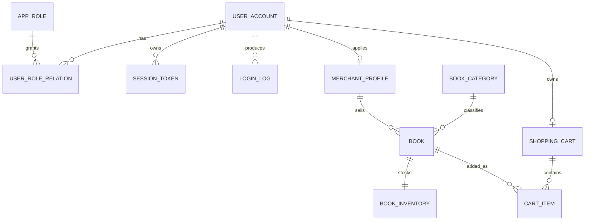

| 项目 | 内容 |
|---|---|
| 项目名称 | CipherBook 在线书店电商系统 |
| 业务场景 | 纸质书零售，服务普通读者、学生及藏书爱好者 |
| 文档版本 | V1.2 依据《数据字典V1》修订 |
| 编制日期 | 2026-09-20 |
| 文档状态 | 待第 4 周需求评审 |
| 架构前提 | 前后端分离；认证、鉴权、数据访问与敏感操作均由后端 API 校验 |
| 接口基线 | 《API草案V1.md》及《API草案V1.openapi.yaml》 |
| 数据字段基线 | 《数据字典V1》 |

---

## 1. 引言

### 1.1 目的

本文档定义 CipherBook 在线书店 Project I 的需求基线，覆盖用户管理核心流程及在线书店关键扩展流程，用于指导设计、开发、测试与验收。

### 1.2 范围

- **P0 核心**：注册、登录、退出、查询本人信息、修改本人信息。改密码接口只保留路径边界，是否展开字段级定义待评审确认。
- **P1 扩展**：浏览与搜索图书、查看图书详情、查询购物车、加入购物车。本版已定义字段级接口。
- **P2 预留**：商户商品维护、订单、支付、支付回调、物流与售后、平台管理。本学期只保留接口边界，不定义字段，不参与本周验收。
- **不在本版范围**：真实支付、退款、对账、完整商城后台、复杂物流体系。

### 1.3 术语

| 术语 | 含义 |
|---|---|
| FR | 功能需求 |
| SR | 安全需求 |
| NFR | 非功能需求 |
| UC | 用例 |
| API | 应用编程接口 |
| OpenAPI | 机器可读接口定义文件 |
| 买家 | 普通用户，可注册、登录、浏览、加购、下单 |
| 商户 | 可维护本店图书、处理本店订单 |
| 管理员 | 审核商户与商品、封禁账号、查询审计日志 |
| 支付机构 | 外部系统参与者，通过回调返回支付结果 |

### 1.4 参考文件

1. 《功能需求清单V1.md》
2. 《需求追踪矩阵V1.xlsx》
3. 《API对象清单V0.1.md》
4. 《API草案V1.md》
5. 《API草案V1.openapi.yaml》
6. 《安全与非功能需求清单V1.md》
7. 《数据字典V1》
8. 第 3 周任务书、项目 README、系统角色权限清单

### 1.5 版本与基线说明

本 V1.2 以《API草案V1.md》和《API草案V1.openapi.yaml》为接口基线，以《数据字典V1》为数据字段基线。若本说明书与 API 草案 V1 或数据字典 V1 出现分歧，以 API 草案 V1 和数据字典 V1 为准，并须在下一版同步修正。FR/SR/NFR 编号以《需求追踪矩阵V1.xlsx》为需求基线；API 草案 V1、数据字典 V1 与功能需求清单存在编号错位时，以评审定稿为准。

---

## 2. 总体描述

### 2.1 产品定位

CipherBook 是在线纸质书零售系统，采用前后端分离架构，后端统一负责认证、鉴权、输入校验、资源归属校验、金额与库存权威计算、审计日志。

### 2.2 用户角色

| 角色 | 说明 |
|---|---|
| 买家 | 平台内部业务角色，核心用户 |
| 商户 | 平台内部业务角色，维护本店图书、处理本店订单 |
| 管理员 | 平台内部业务角色，审核、封禁、审计 |
| 支付机构 | 外部系统参与者，通过约定接口回调支付状态 |

### 2.3 业务流程

1. 用户注册流程：UC-USER-001
2. 用户登录与退出流程：UC-USER-002、UC-USER-004
3. 个人信息查询与修改流程：UC-USER-003、UC-USER-005、UC-USER-006
4. 浏览图书并加入购物车流程：UC-BOOK-001、UC-BOOK-002、UC-CART-001、UC-CART-002
5. 商户发布与维护图书流程：UC-MER-001
6. 订单创建与支付流程：UC-ORDER-001、UC-ORDER-002、UC-PAY-001
7. 平台审核与安全审计流程：UC-ADMIN-001、UC-ADMIN-002

### 2.4 运行环境与约束

- 前后端分离；统一 `/api` 前缀，JSON + UTF-8。
- 除本地开发外，必须 HTTPS/TLS。
- 登录成功后由后端签发访问令牌（`Authorization: Bearer <token>`）；受保护接口从令牌解析当前用户，不信任客户端提交的 `userId`、`role`、资源归属字段。
- 后端同时校验角色权限与资源归属，默认拒绝、最小权限、对象级隔离。
- 前端隐藏入口不能代替后端鉴权。
- 请求体 schema 一律 `additionalProperties: false`，未知字段不落库。
- 金额使用字符串承载，币种默认 `CNY`，避免二进制浮点误差。
- 所有错误响应返回 `traceId`，与审计日志关联。

### 2.5 假设与依赖

- 登录凭据形态：本版按访问令牌（`Bearer`）编写，是否最终采用访问令牌或服务端会话待评审确认。
- 注册唯一标识：本版按「用户名 + 手机号均为唯一」编写，待评审确认。
- 金额字段传输格式：本版用字符串；若后端统一用整数分，需同步修改 `Money` 与相关示例。
- 改密码接口是否纳入第 4 周核心接口清单，待评审确认。
- 支付接口是否进入 Project I 验收范围，待第 4 周评审确认。

---

## 3. 功能需求

| 编号 | 需求名称 | 需求描述 | 关联用例 | 阶段归属 |
|---|---|---|---|---|
| FR-USER-001 | 用户注册 | 未注册用户通过合法手机号/登录名创建买家账号；唯一信息冲突返回 409；密码加盐不可逆存储；响应不含密码或哈希 | UC-USER-001 | 项目I必须 |
| FR-USER-002 | 用户登录 | 登录凭证验证成功后创建有效会话或令牌；错误凭据不得建立会话；空值、超长、非法字符服务端拒绝；连续失败 5 次锁定，具体锁定时长待评审确认 | UC-USER-002 | 项目I必须 |
| FR-USER-003 | 用户退出 | 用户主动注销当前会话，清除服务端和客户端登录凭证；原令牌再访问受保护接口应返回未认证 | UC-USER-004 | 项目I必须 |
| FR-USER-004 | 查询个人信息 | 已登录用户仅查看本人资料；敏感字段脱敏；不接受客户端指定用户编号 | UC-USER-003 | 项目I必须 |
| FR-USER-005 | 修改个人信息 | 仅服务端白名单字段可修改；角色、账号状态、审核状态等不可由客户端变更 | UC-USER-005 | 项目I必须 |
| FR-USER-006 | 修改密码 | 旧密码正确才允许修改；新密码加盐哈希存储；响应和日志不含旧密码或新密码。接口字段级定义待评审确认 | UC-USER-006 | 项目I必须（待确认） |
| FR-GOODS-001 | 浏览与搜索图书 | 按书名/作者/ISBN/分类检索，分页返回在售图书，不泄露商户内部数据 | UC-BOOK-001 | 项目I扩展 |
| FR-GOODS-002 | 查看图书详情 | 展示服务端权威价格、库存与简介；已下架图书返回不存在或不可访问 | UC-BOOK-002 | 项目I扩展 |
| FR-CART-001 | 查询购物车 | 只返回本人购物车；金额以服务端商品价格计算；不接受客户端传入归属编号 | UC-CART-001 | 项目I扩展 |
| FR-CART-002 | 加入购物车 | 校验图书状态、库存与购买数量；不信任客户端提交的价格与总价 | UC-CART-002 | 项目I扩展 |
| FR-MER-001 | 维护本店图书 | 商户仅能维护本店图书；跨商户操作应被拒绝并写入审计日志 | UC-MER-001 | 项目I扩展 |
| FR-ORDER-001 | 创建与查询订单 | 买家基于购物车创建订单，并可查询本人订单状态 | UC-ORDER-001 | 项目I扩展 |
| FR-ORDER-002 | 处理本店订单发货 | 商户只能查看并处理本店订单；发货后订单状态可查询 | UC-ORDER-002 | 项目I扩展 |
| FR-PAY-001 | 支付请求与回调 | 支付回调须验签、校验金额与订单号并保证幂等；支付机构不得直连业务数据库 | UC-PAY-001 | 项目II预留 |
| FR-ADMIN-001 | 审核商户与商品 | 管理员审核商户资质与违规商品；审核结论与操作人可追溯 | UC-ADMIN-001 | 项目I扩展 |
| FR-ADMIN-002 | 账号封禁与审计日志 | 管理员可查询审计日志；系统不提供修改或删除入口 | UC-ADMIN-002 | 项目I扩展 |

### 3.1 补强与待确认功能

1. **找回密码**：原《功能需求清单V1.md》有 FR-USER-004 找回密码，但追踪矩阵和 API 清单未覆盖。建议第 4 周评审决定是否纳入 P1；若纳入，应新增 UC-USER-007、API-AUTH-003，并补充防枚举、限流、验证码等安全要求。
2. **登录失败锁定**：按《API草案V1.md》第 3.2 节，本版暂按 `SR-AUTH-002`「同一账号连续登录失败 5 次必须锁定」执行，返回 `423 Locked`。`功能需求清单V1.md` 的 `FR-USER-007` 写「连续输入错误 10 次后冻结 15 分钟」，两处阈值不一致，锁定时长也待统一，需在评审会上确定单一数值，本文件、API 草案、追踪矩阵同步修正。
3. **退出需求编号**：正式编号 FR-USER-003 为“用户退出”，与《API草案V1.md》一致；原功能清单 FR-USER-003 为“查看个人信息”，需修订。
4. **改密码接口**：`PUT /api/users/me/password` 在 V0.1 中关联 `FR-USER-006`、`UC-USER-006`，但《API草案V1.md》第 9 节指出第 4 周用户管理核心接口清单未明确列入，本版只保留路径边界、不展开字段级定义。是否纳入 P0 待评审确认。
5. **购物车编号一致性**：《数据字典V1》第 9 节指出，现有 API 草案 V1 在购物车条目中使用了 `FR-CART-001/002`，而第 3 周功能需求清单将浏览与加购能力归入 `FR-GOODS-001`。本版暂按追踪矩阵和 API 草案的拆分口径保留 `FR-CART-001/002`，最终编号以评审定稿为准。

---

## 4. 安全与非功能需求

| 编号 | 需求描述 | 验收方法 |
|---|---|---|
| SR-DATA-001 | 密码不得以明文形式存储 | 检查数据库中不存在原始密码 |
| SR-INPUT-001 | 登录参数必须在服务端校验 | 提交空值、超长值和非法字符，系统应拒绝 |
| SR-AUTH-001 | 普通用户只能查询本人信息 | 修改请求中的用户编号，服务器应拒绝访问 |
| SR-SESSION-001 | 用户退出后原会话必须失效 | 使用退出前的令牌再次访问，应返回未认证 |
| SR-LOG-001 | 日志不得记录密码和密钥 | 检查注册、登录和异常日志 |
| SR-SQL-001 | 数据库查询不得拼接用户输入 | 代码检查并执行 SQL 注入测试 |
| SR-AUTH-002 | 同一账号连续登录失败 5 次必须锁定 | 连续输入 5 次错误密码，系统应提示账号锁定；返回 `423 Locked`。锁定时长待评审确认 |
| NFR-PERF-001 | 商品列表页在 50 并发下响应时间不超过 2 秒 | 模拟 50 并发请求商品列表，检查平均响应时间 |
| NFR-REL-001 | 系统异常时必须返回统一友好提示 | 模拟服务异常，前端不暴露堆栈信息或 500 页面 |

补充约束：

- 登录失败统一提示“账号或密码错误”，不得泄露账号是否存在、是否被锁定。
- 所有受保护接口必须校验登录状态、角色权限和资源归属。
- 密码和令牌不得出现在 URL 查询参数、日志、接口响应中。
- 登录、退出、密码修改、鉴权失败和敏感操作应记录操作人、时间、对象、结果及请求追踪编号。
- 所有错误响应返回 `traceId`，与审计日志关联。
- 请求体 schema 一律 `additionalProperties: false`，未知字段不落库。
- 金额使用字符串承载，币种默认 `CNY`。

---

## 5. 外部接口

接口字段级定义以《API草案V1.md》和《API草案V1.openapi.yaml》为准。本章只列接口对象、用途、参与者、关键约束与追踪关系。

### 5.1 P0 核心接口（已定义字段）

| 编号 | 方法与路径 | 用途 | 参与者与鉴权 | 关键约束 | 编号追踪 |
|---|---|---|---|---|---|
| API-USER-001 | `POST /api/users/register` | 创建买家账号 | 未注册访客；公开接口，限流防重 | 请求体 `RegisterRequest`：`username`、`phone`、`password` 全部必填，`additionalProperties: false`；用户名 `^[A-Za-z0-9_]{4,32}$`；手机号 `^1[3-9][0-9]{9}$`；密码 8–64 位，加盐不可逆；响应不含密码或哈希；唯一冲突返回 `409` | UC-USER-001；FR-USER-001；SR-DATA-001、SR-SQL-001、SR-INPUT-001；NFR-REL-001 |
| API-AUTH-001 | `POST /api/auth/login` | 验证凭据并创建访问令牌 | 已注册且账号可用的内部角色；公开接口 | 请求体 `LoginRequest`：`account`、`password`；成功返回 `accessToken`、`tokenType`、`expiresIn`、`user`，响应头 `Cache-Control: no-store`；错误凭据不得建立会话；失败提示统一为“账号或密码错误”，不泄露账号是否存在或是否被锁定；连续失败达阈值返回 `423`；令牌不得写入日志 | UC-USER-002；FR-USER-002；SR-INPUT-001、SR-AUTH-002、SR-LOG-001、NFR-REL-001 |
| API-AUTH-002 | `POST /api/auth/logout` | 注销当前会话/令牌 | 已登录用户；需要有效登录凭据 | 退出成功后原令牌立即失效；重复退出幂等；不影响其他设备或用户；记录操作结果但不记录令牌内容；成功返回 `204` | UC-USER-004；FR-USER-003；SR-SESSION-001、SR-LOG-001 |
| API-USER-002 | `GET /api/users/me` | 查询本人资料 | 已登录买家、商户或管理员；本人数据范围 | 没有任何标识用户身份的请求参数；身份只从服务端令牌解析；不接受客户端指定用户编号；手机号、邮箱脱敏展示；不返回密码或哈希 | UC-USER-003；FR-USER-004；SR-AUTH-001、SR-LOG-001 |
| API-USER-003 | `PUT /api/users/me` | 修改本人允许维护的资料 | 已登录用户；本人数据范围 | 请求体 `UpdateProfileRequest` 白名单字段：`nickname`、`email`、`phone`；`additionalProperties: false`；`userId`、`role`、`status` 即使被提交也必须被服务端忽略或拒绝；手机号、邮箱做格式与归属校验；敏感资料变更记录审计信息 | UC-USER-005；FR-USER-005；SR-INPUT-001、SR-AUTH-001、SR-LOG-001 |

**待确认接口**：`PUT /api/users/me/password`（改密码）在 V0.1 中关联 `FR-USER-006`、`UC-USER-006`、`SR-DATA-001`、`SR-LOG-001`，但《API草案V1.md》第 9 节指出第 4 周用户管理核心接口清单未明确列入该接口。本版只保留路径边界，不展开字段级定义；若评审确认纳入，则在 V1.3 补齐 `oldPassword`、`newPassword`（含旧密码校验与新密码强度要求）。

### 5.2 P1 扩展接口（已定义字段）

| 编号 | 方法与路径 | 用途 | 参与者与鉴权 | 关键约束 | 编号追踪 |
|---|---|---|---|---|---|
| API-BOOK-001 | `GET /api/books` | 分页浏览和搜索在售图书 | 公开只读（未登录亦可） | `size` 上限 50；只返回在售图书；不暴露商户内部数据 | UC-BOOK-001；FR-GOODS-001；NFR-PERF-001 |
| API-BOOK-002 | `GET /api/books/{bookId}` | 查询单本图书详情 | 公开只读 | 不区分“图书不存在”与“无权限”，统一返回 `404`；价格与库存只作为服务端权威数据展示 | UC-BOOK-002；FR-GOODS-002 |
| API-CART-001 | `GET /api/cart` | 查询当前买家的购物车 | 已登录买家；仅本人购物车 | 购物车归属只从登录身份获取，不接受客户端传入其他用户编号；金额以服务端商品价格计算；失效或不可售条目返回 `available: false` 并附原因 | UC-CART-001；FR-CART-001；SR-AUTH-001 |
| API-CART-002 | `POST /api/cart/items` | 将指定在售图书加入购物车 | 已登录买家；仅本人购物车 | 只允许提交 `bookId` 与 `quantity`；不得信任客户端提交的价格、总价或归属用户编号；校验图书状态、库存与购买数量 | UC-CART-002；FR-CART-002；SR-AUTH-001、SR-INPUT-001 |

### 5.3 P2 预留边界（不定义字段）

以下对象属于项目 II、III 的集成边界或本学期不实现的范围。V1.2 只保留方向，不固定请求、响应结构，不参与本周验收。

| API 对象 | 预期路径方向 | 用途 | 当前状态 |
|---|---|---|---|
| 商户商品维护 | `/api/merchant/books...` | 商户创建、修改、上下架本店书籍 | 预留；需按商户归属隔离 |
| 订单 | `/api/orders...` | 买家创建和查询订单，商户处理本店订单 | 预留；涉及库存、价格快照和状态机 |
| 支付 | `/api/payments...` | 买家发起支付，支付机构返回处理结果 | 留待项目 II；真实支付、退款及对账不在本学期 |
| 支付回调 | `/api/payments/callback` | 支付机构回调支付状态 | 仅保留外部集成边界；必须验签、校验金额与订单号并保证幂等 |
| 物流与售后 | `/api/shipments...`、`/api/after-sales...` | 发货、物流查询、退货和售后 | 留待项目 II |
| 平台管理 | `/api/admin/...` | 商户审核、账号管理、违规处置和审计查询 | 预留；高风险操作需授权、二次确认和审计 |

### 5.4 通用约定与状态码基线

1. **基础路径与编码**：统一 `/api` 前缀；请求与响应默认 `application/json`，字符编码 UTF-8。
2. **传输安全**：除本地开发环境外，所有接口必须通过 HTTPS/TLS 访问；密码和令牌不得出现在 URL 查询参数中。
3. **身份来源**：登录成功后由后端签发访问令牌（`Authorization: Bearer <token>`）；受保护接口从令牌解析当前用户，不信任客户端提交的 `userId`、`role` 或资源归属字段。
4. **鉴权原则**：后端同时校验角色权限与资源归属，遵循默认拒绝、最小权限、对象级隔离。前端隐藏入口不能代替后端鉴权。
5. **数据最小化**：接口不得返回明文密码、密码哈希、密钥、完整支付凭证或与当前业务无关的个人信息。
6. **输入校验**：所有请求参数在服务端校验；请求体 schema 一律 `additionalProperties: false`，未知字段不落库；数据库查询必须参数化，不能拼接用户输入。
7. **金额表示**：金额使用字符串承载（如 `"45.00"`），避免二进制浮点误差；币种默认 `CNY`。
8. **审计追踪**：登录、退出、密码修改、鉴权失败和敏感操作记录操作人、时间、对象、结果与请求追踪编号；日志不得记录密码或令牌。
9. **请求追踪**：所有错误响应返回 `traceId`，与审计日志关联，便于第 6 周威胁建模和问题定位。

状态码与错误语义：

| 状态码 | 使用场景 | 业务错误码示例 | 约束 |
|---|---|---|---|
| `200 OK` | 查询、修改、登录成功 | — | 返回必要业务结果，不返回敏感字段 |
| `201 Created` | 注册成功 | — | 只返回资源标识与最小公开资料 |
| `204 No Content` | 退出成功 | — | 无响应体 |
| `400 Bad Request` | 参数缺失、格式错误、非法状态 | `VALIDATION_ERROR` | 返回字段级提示，不返回堆栈 |
| `401 Unauthorized` | 未登录、凭据无效、会话失效 | `AUTH_INVALID_CREDENTIALS`、`AUTH_UNAUTHENTICATED` | 登录失败提示不得泄露账号是否存在 |
| `403 Forbidden` | 已登录但角色或资源归属校验不通过 | `AUTH_FORBIDDEN` | 后端拒绝并记录越权尝试，不依赖前端拦截 |
| `404 Not Found` | 资源不存在或按安全策略隐藏越权资源 | `RESOURCE_NOT_FOUND` | 不得泄露其他用户、商户或内部资源信息 |
| `409 Conflict` | 登录名、手机号等唯一信息冲突 | `USER_ALREADY_EXISTS` | 给出可操作提示 |
| `423 Locked` | 连续登录失败导致账号锁定 | `AUTH_ACCOUNT_LOCKED` | 锁定阈值须与安全需求最终数值一致 |
| `429 Too Many Requests` | 超过限流阈值 | `RATE_LIMITED` | 防暴力破解与批量注册 |
| `500 Internal Server Error` | 未预期服务异常 | `INTERNAL_ERROR` | 只返回统一友好提示与 `traceId`，不暴露堆栈或数据库信息 |

统一错误响应结构：`{ code, message, traceId, details? }`。`code` 是稳定业务错误码，供前端分支处理，不随文案变化；`message` 面向用户，不得泄露敏感状态。

---

## 6. 数据需求

本章依据《数据字典V1》编写。数据对象、字段、约束、安全底线、留存与删除要求均以《数据字典V1》为准。

### 6.1 数据对象与字段

《数据字典V1》包含以下对象：用户账号、角色、用户角色关系、会话令牌、登录日志、商户档案、图书分类、图书、图书库存、购物车、购物车明细。每个对象均定义字段名、中文名、类型、必填/可空、默认值与约束、API 字段、敏感级、存储与展示方式。

以购物车明细为例：

| 字段名 | 中文名 | 类型 | 必填/可空 | 默认值与约束 | API 字段 | 敏感级 | 存储与展示方式 |
|---|---|---|---|---|---|---|---|
| `cart_item_id` | 明细主键 | `BIGINT UNSIGNED` | 必填 | 主键 | 不直接返回 | S1 | 内部标识 |
| `cart_id` | 购物车主键 | `BIGINT UNSIGNED` | 必填 | 外键；不可修改 | 不返回 | S1 | 仅本人购物车服务可访问 |
| `book_id` | 图书主键 | `BIGINT UNSIGNED` | 必填 | 外键；不可修改 | `bookId` | S0 | 加购时由服务端校验图书存在且在售 |
| `quantity` | 购买数量 | `SMALLINT UNSIGNED` | 必填 | 1—999；加购时累加但不得超过上限 | `quantity` | S0 | 只返回本人购物车；价格由服务端计算 |
| `selected` | 是否选中结算 | `TINYINT(1)` | 必填 | 默认 `1` | 不返回 | S0 | 仅本人可见；结算规则由后端校验 |
| `added_at` | 加入时间 | `DATETIME(3)` | 必填 | 首次加入时写入 | 不返回 | S1 | 仅本人购物车服务可见 |
| `updated_at` | 更新时间 | `DATETIME(3)` | 必填 | 服务端自动更新 | 不返回 | S1 | 审计字段 |

其余对象字段详见《数据字典V1》第 4 节。

### 6.2 对象关系

关系约束：

1. `user_account` 与 `user_role_relation` 是一对多；`app_role` 与 `user_role_relation` 是一对多。
2. `user_account` 与 `session_token`、`login_log` 是一对多；账号禁用或注销时必须撤销全部有效会话。
3. `merchant_profile.user_id` 唯一；只有审核通过且状态为 `active` 的商户档案可访问本店图书管理。
4. `book.merchant_id` 决定对象级数据边界；商户查询、更新和删除图书时必须同时满足 `merchant_id = 当前商户`。
5. `book_inventory.book_id` 唯一；库存以独立表保存，避免在图书公开记录中暴露精确库存。
6. `cart_item.cart_id` 决定买家数据边界；购物车接口只返回当前登录用户的数据。
7. 所有外键删除行为采用 `RESTRICT` 或逻辑删除；不得因删除图书、分类或用户破坏历史审计数据。

### 6.3 数据库字段与 API 字段映射

| API 字段或对象 | 数据对象/字段 | 映射规则 |
|---|---|---|
| `userId` | `user_account.user_id` | 整数主键转字符串或整数返回；不得接受客户端指定用户 |
| `username` | `user_account.username` | 一对一映射，登录名不可修改 |
| `password` | 不落库 | 只在 HTTPS 请求体中出现；服务端校验后写入 `password_hash` |
| `phone` | `user_account.phone_ciphertext`、`phone_hash` | API 返回脱敏值；查找使用 `phone_hash` |
| `email` | `user_account.email_ciphertext`、`email_hash` | API 返回脱敏值；查找使用 `email_hash` |
| `role` | `app_role.role_code` | 通过当前用户的有效主角色关系解析；普通用户不返回关系主键 |
| `status` | `user_account.status` | 只允许 `active`、`locked`、`disabled` |
| `accessToken` | 不保存原始值 | 只保存 `session_token.token_hash`；退出后 `revoked_at` 立即更新 |
| `expiresIn` | `session_token.issued_at` 与 `expires_at` | 返回剩余秒数，不暴露内部数据库时间 |
| `bookId` | `book.book_id` | 数据库整数以十进制字符串传输，正则 `^[0-9]{1,12}$` |
| `title`、`author`、`publisher`、`isbn`、`intro`、`coverUrl` | `book.title`、`book.author`、`book.publisher`、`book.isbn`、`book.intro`、`book.cover_url` | 一对一映射；只返回审核通过且在售/可查看数据 |
| `category` | `book_category.category_name` | 通过 `book.category_id` 解析，不直接返回内部排序数据 |
| `price` | `book.price_amount` | 数据库 `DECIMAL(10,2)` 转为字符串，如 `"45.00"`；客户端不可提交可信价格 |
| `currency` | `book.currency` | 默认 `CNY` |
| `stockStatus` | `book.sale_status` 与 `book_inventory` 计算 | `in_stock`、`low_stock`、`out_of_stock`、`off_shelf` 只由服务端计算；不返回精确库存 |
| `ownerUserId` | `shopping_cart.user_id` | 只从认证会话解析；不接受客户端传入 |
| `Cart.items[].bookId` | `cart_item.book_id` | 与图书主键映射 |
| `Cart.items[].quantity` | `cart_item.quantity` | 1—999；加购接口必须进行服务端校验 |
| `Cart.items[].unitPrice` | `book.price_amount` | 实时读取当前售价，不作为购物车可信快照 |
| `Cart.items[].available` | 图书与库存状态计算 | 下架、无库存或数量不合法时为 `false`，并返回可理解原因 |
| `traceId` | `login_log.trace_id` 或统一请求追踪记录 | API 错误响应可返回；不得包含手机号、邮箱、令牌或 SQL |

### 6.4 安全底线与数据实施要求

| 安全底线 | 数据字典落点 | 可验收方法 |
|---|---|---|
| 密码不得明文存储 | `user_account.password_hash` 只保存加盐不可逆哈希，表内无明文密码列 | 检查表结构和数据不存在明文密码；响应、日志和异常中无 `password` 原始值 |
| 数据库查询不得拼接用户输入 | 所有登录名、手机号查找使用 `username`、`phone_hash` 等参数化查询 | 执行 SQL 注入测试，输入特殊字符不能改变查询结构 |
| 不越权 | `shopping_cart.user_id`、`book.merchant_id`、`user_role_relation.user_id` 作为对象归属边界 | 修改请求中的用户、商户、购物车和图书标识，非归属者必须返回拒绝 |
| 登录参数服务端校验 | 登录只接受 `account`、`password`；长度、类型、空值由后端校验 | 提交空值、超长值、非法字符和错误类型，均返回统一校验错误 |
| 日志不记密码与密钥 | `login_log` 不含密码、令牌；`trace_id` 不含敏感值 | 检查登录、注册、异常和审计日志，不出现密码、哈希、令牌、密钥 |
| 退出后会话失效 | `session_token.revoked_at` 在退出成功后立即写入；认证服务每次校验 | 使用退出前令牌再次访问受保护接口，应返回 `401` |
| 暴力破解防护 | `failed_login_count`、`locked_until`、`login_log` 配合锁定策略 | 连续失败达到阈值后提示锁定；成功登录后计数清零并记录日志 |
| 敏感信息最小化 | 手机号、邮箱、证照号、IP 按敏感级别处理 | 检查 API 响应、后台页面和导出文件，均不返回超出职责范围的数据 |
| 状态可信 | `sale_status`、库存、会话撤销时间只由后端事务修改 | 客户端直接提交价格、库存、角色、状态等字段时被拒绝或忽略 |

### 6.5 留存、删除与匿名化

| 数据对象 | 建议留存 | 到期处理 |
|---|---|---|
| 用户账号 | 账号存续期间；注销后按业务与合规要求留存 | 先禁用、撤销会话；与交易无关的个人信息匿名化 |
| 角色、用户角色关系 | 长期保留 | 保留授权变更历史；不再有效的记录标记 `revoked` 或 `expired` |
| 会话令牌 | 过期或撤销后保留 30 天用于安全审计 | 到期物理删除或归档；原始令牌从不保存 |
| 登录日志 | 180 天 | 到期匿名化或归档；不得保留明文账号、密码或令牌 |
| 商户档案 | 商户存续期间 | 关停后保留审计所需的最小记录，证照密文按合规策略销毁或归档 |
| 图书、分类、库存 | 商品存续期间 | 已产生交易关联的记录只做下架/逻辑删除；库存变更流水单独审计 |
| 购物车及明细 | 活跃期间；长期不活跃建议 180 天后清理 | 清理前不影响历史订单；只删除购物意向数据，不删除交易凭证 |

删除要求：

- 任何物理删除必须经过授权并记录操作人、时间、对象、原因和结果。
- 审计日志不得由普通管理员修改或删除；需要清理时只允许按策略归档。
- 测试、演示和仓库中不得使用真实手机号、邮箱、密码、令牌、数据库账号或商户证照号。
- 生产导出文件必须脱敏、加密并设置有效期，不得将完整个人信息写入 CSV、日志或聊天记录。

### 6.6 数据追溯矩阵

| 数据对象 | 相关 API | 功能需求 | 安全与非功能需求 | 验收要点 |
|---|---|---|---|---|
| `user_account` | API-USER-001、API-USER-002、API-USER-003、API-AUTH-001 | FR-USER-001、FR-USER-003、FR-USER-006、FR-USER-007 | SR-DATA-001、SR-INPUT-001、SR-AUTH-001、SR-LOG-001 | 可注册、查询和修改本人资料；密码不可逆；重复手机号被拒绝 |
| `app_role`、`user_role_relation` | API-AUTH-001 | 角色权限与授权变更规则 | SR-AUTH-001、审计要求 | 买家、商户、管理员权限边界正确；角色变更留痕 |
| `session_token` | API-AUTH-001、API-AUTH-002 | FR-USER-002、FR-USER-008 | SR-SESSION-001、SR-LOG-001 | 登录后建立会话；退出后旧令牌立即失效 |
| `login_log` | API-AUTH-001 | FR-USER-007 | SR-AUTH-002、SR-LOG-001 | 连续失败可锁定；日志不含密码、令牌和密钥 |
| `merchant_profile` | 商户审核预留接口 | FR-GOODS-002 | SR-AUTH-001、对象级隔离 | 未审核商户不能维护图书；跨店数据被拒绝 |
| `book_category`、`book` | API-BOOK-001、API-BOOK-002 | FR-GOODS-001、FR-GOODS-002 | NFR-PERF-001、SR-INPUT-001 | 只返回在售图书；价格和状态由服务端决定 |
| `book_inventory` | API-BOOK-002、API-CART-002 | FR-GOODS-001、FR-ORDER-001 | SR-INPUT-001、状态可信 | 不可售和库存不足被正确识别；库存不能为负 |
| `shopping_cart`、`cart_item` | API-CART-001、API-CART-002 | FR-GOODS-001 | SR-AUTH-001、SR-INPUT-001 | 仅本人购物车可访问；客户端价格和归属字段无效 |

**编号一致性说明**：现有仓库 API 草案 V1 在购物车条目中使用了 `FR-CART-001/002`，而第 3 周功能需求清单目前将浏览与加购能力归入 `FR-GOODS-001`。本数据字典不新增需求编号，优先引用现有功能需求清单中的 `FR-GOODS-001`；需求规格说明书定稿时应统一最终编号，数据对象和字段无需因此改变。

### 6.7 评审检查清单

- [x] 已包含用户、角色、用户角色关系、会话令牌、登录日志 5 个必交对象。
- [x] 已包含 6 个在线书店场景对象，满足不少于 2 个的要求。
- [x] 每个对象均给出用途、主键、唯一约束、外键、索引和生命周期。
- [x] 每个字段均给出名称、类型、必填性、约束、API 映射、敏感级别与展示方式。
- [x] 密码、令牌、手机号、邮箱、证照号和 IP 均标明存储与展示方式。
- [x] 六条安全底线均有对应字段或实施要求和验收方法。
- [x] API 字段和数据对象通过映射表贯通；订单、支付对象明确保留为 P2 边界。
- [x] 数据字典未包含真实账号、密码、密钥或个人敏感信息。

---

## 7. 需求追踪矩阵

### 7.1 需求追踪矩阵明细

| 序号 | 角色 | 业务流程 | 用例编号 | 用例名称 | 需求编号 | 需求类型 | 验收方式（可观察结果） | 负责人 | 复核人 | 阶段归属 |
|---:|---|---|---|---|---|---|---|---|---|---|
| 1 | 买家 | 用户注册流程 | UC-USER-001 | 用户注册 | FR-USER-001 | 功能需求 | 提交合法登录名与密码可注册成功，重复登录名返回冲突，响应不含密码或哈希 | 方越 | 王鹏宇 | 项目I必须 |
| 2 | 买家 | 用户注册流程 | UC-USER-001 | 用户注册 | SR-DATA-001 | 安全需求 | 检查数据库中不存在原始密码 | 王鹏宇 | 李陶然 | 项目I必须 |
| 3 | 买家 | 用户注册流程 | UC-USER-001 | 用户注册 | SR-SQL-001 | 安全需求 | 代码检查并执行 SQL 注入测试 | 王鹏宇 | 李陶然 | 项目I必须 |
| 4 | 买家、商户、管理员 | 用户登录与退出流程 | UC-USER-002 | 用户登录 | FR-USER-002 | 功能需求 | 正确凭据登录成功并返回有效令牌，错误凭据不得建立会话 | 方越 | 王鹏宇 | 项目I必须 |
| 5 | 买家、商户、管理员 | 用户登录与退出流程 | UC-USER-002 | 用户登录 | SR-INPUT-001 | 安全需求 | 提交空值、超长值和非法字符，系统应拒绝 | 王鹏宇 | 李陶然 | 项目I必须 |
| 6 | 买家、商户、管理员 | 用户登录与退出流程 | UC-USER-002 | 用户登录 | SR-AUTH-002 | 安全需求 | 连续输入5次错误密码，系统应提示账号锁定 | 王鹏宇 | 李陶然 | 项目I必须 |
| 7 | 买家、商户、管理员 | 用户登录与退出流程 | UC-USER-002 | 用户登录 | SR-LOG-001 | 安全需求 | 检查注册、登录和异常日志 | 王鹏宇 | 李陶然 | 项目I必须 |
| 8 | 买家、商户、管理员 | 用户登录与退出流程 | UC-USER-002 | 用户登录 | NFR-REL-001 | 非功能需求 | 模拟服务异常，前端不暴露堆栈信息或500页面 | 张桐睿 | 王陈俊 | 项目I必须 |
| 9 | 买家、商户、管理员 | 用户登录与退出流程 | UC-USER-004 | 用户退出 | FR-USER-003 | 功能需求 | 退出成功后再用原令牌访问受保护接口，应返回未认证 | 方越 | 王鹏宇 | 项目I必须 |
| 10 | 买家、商户、管理员 | 用户登录与退出流程 | UC-USER-004 | 用户退出 | SR-SESSION-001 | 安全需求 | 使用退出前的令牌再次访问，应返回未认证 | 王鹏宇 | 李陶然 | 项目I必须 |
| 11 | 买家、商户、管理员 | 个人信息查询与修改流程 | UC-USER-003 | 查询个人信息 | FR-USER-004 | 功能需求 | 仅返回本人资料且敏感字段脱敏，不接受客户端指定用户编号 | 方越 | 王鹏宇 | 项目I必须 |
| 12 | 买家、商户、管理员 | 个人信息查询与修改流程 | UC-USER-003 | 查询个人信息 | SR-AUTH-001 | 安全需求 | 修改请求中的用户编号，服务器应拒绝访问 | 王鹏宇 | 李陶然 | 项目I必须 |
| 13 | 买家、商户、管理员 | 个人信息查询与修改流程 | UC-USER-005 | 修改个人信息 | FR-USER-005 | 功能需求 | 仅白名单字段可修改，角色、账号状态等字段不可由客户端变更 | 方越 | 王鹏宇 | 项目I必须 |
| 14 | 买家、商户、管理员 | 个人信息查询与修改流程 | UC-USER-006 | 修改密码 | FR-USER-006 | 功能需求 | 旧密码正确才允许修改，新密码以加盐哈希存储且响应不含密码 | 方越 | 王鹏宇 | 项目I必须 |
| 15 | 买家 | 浏览图书并加入购物车流程 | UC-BOOK-001 | 浏览与搜索图书 | FR-GOODS-001 | 功能需求 | 按书名/作者/ISBN/分类检索，分页返回在售图书且不泄露商户内部数据 | 王陈俊 | 方越 | 项目I扩展 |
| 16 | 买家 | 浏览图书并加入购物车流程 | UC-BOOK-001 | 浏览与搜索图书 | NFR-PERF-001 | 非功能需求 | 模拟50并发请求商品列表，检查平均响应时间 | 张桐睿 | 王陈俊 | 项目I扩展 |
| 17 | 买家 | 浏览图书并加入购物车流程 | UC-BOOK-002 | 查看图书详情 | FR-GOODS-002 | 功能需求 | 展示服务端权威的价格、库存与简介；已下架图书返回不存在或不可访问 | 王陈俊 | 方越 | 项目I扩展 |
| 18 | 买家 | 浏览图书并加入购物车流程 | UC-CART-001 | 查询购物车 | FR-CART-001 | 功能需求 | 只返回本人购物车，金额以服务端商品价格计算，不接受客户端传入归属编号 | 王陈俊 | 方越 | 项目I扩展 |
| 19 | 买家 | 浏览图书并加入购物车流程 | UC-CART-002 | 加入购物车 | FR-CART-002 | 功能需求 | 校验图书状态、库存与购买数量，不信任客户端提交的价格与总价 | 王陈俊 | 方越 | 项目I扩展 |
| 20 | 商户 | 商户发布与维护图书流程 | UC-MER-001 | 维护本店图书 | FR-MER-001 | 功能需求 | 商户仅能维护本店图书，跨商户操作应被拒绝并写入审计日志 | 张桐睿 | 方越 | 项目I扩展 |
| 21 | 买家 | 订单创建与支付流程 | UC-ORDER-001 | 创建与查询订单 | FR-ORDER-001 | 功能需求 | 买家基于购物车创建订单并可查询本人订单状态 | 张桐睿 | 方越 | 项目I扩展 |
| 22 | 商户 | 订单创建与支付流程 | UC-ORDER-002 | 处理本店订单发货 | FR-ORDER-002 | 功能需求 | 商户只能查看并处理本店订单，发货后订单状态可查询 | 张桐睿 | 方越 | 项目I扩展 |
| 23 | 支付机构 | 订单创建与支付流程 | UC-PAY-001 | 支付请求与回调 | FR-PAY-001 | 功能需求 | 支付回调须验签、校验金额与订单号并保证幂等；支付机构不得直连业务数据库 | 张桐睿 | 方越 | 项目II预留 |
| 24 | 管理员 | 平台审核与安全审计流程 | UC-ADMIN-001 | 审核商户与商品 | FR-ADMIN-001 | 功能需求 | 管理员审核商户资质与违规商品，审核结论与操作人可追溯 | 张桐睿 | 王鹏宇 | 项目I扩展 |
| 25 | 管理员 | 平台审核与安全审计流程 | UC-ADMIN-002 | 账号封禁与审计日志 | FR-ADMIN-002 | 功能需求 | 管理员可查询审计日志，且系统不提供修改或删除入口 | 张桐睿 | 王鹏宇 | 项目I扩展 |

### 7.2 统计概览

#### 一、需求条数与验收下限

| 指标 | 数量 | 验收下限 | 是否达标 |
|---|---:|---:|---|
| 功能需求条数（FR-*） | 16 | 10 | 达标 |
| 其中：用户管理核心需求（FR-USER-*） | 6 | 6 | 达标 |
| 安全需求条数（SR-*） | 7 | 6 | 达标 |
| 安全与非功能需求合计（SR-* + NFR-*） | 9 | 8 | 达标 |
| 需求条目合计 | 25 | 18 | 达标 |

#### 二、业务流程覆盖

| 业务流程 | 关联需求条目数 | 覆盖用例 | 是否覆盖 |
|---|---:|---|---|
| 用户注册流程 | 3 | UC-USER-001 | 已覆盖 |
| 用户登录与退出流程 | 7 | UC-USER-002、UC-USER-004 | 已覆盖 |
| 个人信息查询与修改流程 | 4 | UC-USER-003、UC-USER-005、UC-USER-006 | 已覆盖 |
| 浏览图书并加入购物车流程 | 5 | UC-BOOK-001、UC-BOOK-002、UC-CART-001、UC-CART-002 | 已覆盖 |
| 商户发布与维护图书流程 | 1 | UC-MER-001 | 已覆盖 |
| 订单创建与支付流程 | 3 | UC-ORDER-001、UC-ORDER-002、UC-PAY-001 | 已覆盖 |
| 平台审核与安全审计流程 | 2 | UC-ADMIN-001、UC-ADMIN-002 | 已覆盖 |
| 合计 | 25 | — | — |

#### 三、用例覆盖

| 用例编号 | 用例名称 | 关联需求条目数 | 是否覆盖 |
|---|---|---:|---|
| UC-USER-001 | 用户注册 | 3 | 已覆盖 |
| UC-USER-002 | 用户登录 | 5 | 已覆盖 |
| UC-USER-003 | 查询个人信息 | 2 | 已覆盖 |
| UC-USER-004 | 用户退出 | 2 | 已覆盖 |
| UC-USER-005 | 修改个人信息 | 1 | 已覆盖 |
| UC-USER-006 | 修改密码 | 1 | 已覆盖 |
| UC-BOOK-001 | 浏览与搜索图书 | 2 | 已覆盖 |
| UC-BOOK-002 | 查看图书详情 | 1 | 已覆盖 |
| UC-CART-001 | 查询购物车 | 1 | 已覆盖 |
| UC-CART-002 | 加入购物车 | 1 | 已覆盖 |
| UC-MER-001 | 维护本店图书 | 1 | 已覆盖 |
| UC-ORDER-001 | 创建与查询订单 | 1 | 已覆盖 |
| UC-ORDER-002 | 处理本店订单发货 | 1 | 已覆盖 |
| UC-ADMIN-001 | 审核商户与商品 | 1 | 已覆盖 |
| UC-ADMIN-002 | 账号封禁与审计日志 | 1 | 已覆盖 |
| UC-PAY-001 | 支付请求与回调 | 1 | 已覆盖 |
| 合计 | — | 25 | — |

#### 四、角色覆盖

| 角色 | 关联需求条目数 | 是否覆盖 | 说明 |
|---|---:|---|---|
| 买家 | 20 | 已覆盖 | 平台内部业务角色 |
| 商户 | 13 | 已覆盖 | 平台内部业务角色 |
| 管理员 | 13 | 已覆盖 | 平台内部业务角色 |
| 支付机构 | 1 | 已覆盖 | 外部系统参与者 |

### 7.3 API 草案 V1 接口 → 需求 → 用例对照表

| 接口编号 | 方法与路径 | 用例编号 | 功能需求 | 安全/非功能需求 |
|---|---|---|---|---|
| API-USER-001 | `POST /api/users/register` | UC-USER-001 | FR-USER-001 | SR-DATA-001、SR-SQL-001、SR-INPUT-001、NFR-REL-001 |
| API-AUTH-001 | `POST /api/auth/login` | UC-USER-002 | FR-USER-002 | SR-INPUT-001、SR-AUTH-002、SR-LOG-001、NFR-REL-001 |
| API-AUTH-002 | `POST /api/auth/logout` | UC-USER-004 | FR-USER-003 | SR-SESSION-001、SR-LOG-001 |
| API-USER-002 | `GET /api/users/me` | UC-USER-003 | FR-USER-004 | SR-AUTH-001、SR-LOG-001 |
| API-USER-003 | `PUT /api/users/me` | UC-USER-005 | FR-USER-005 | SR-INPUT-001、SR-AUTH-001、SR-LOG-001 |
| API-BOOK-001 | `GET /api/books` | UC-BOOK-001 | FR-GOODS-001 | NFR-PERF-001 |
| API-BOOK-002 | `GET /api/books/{bookId}` | UC-BOOK-002 | FR-GOODS-002 | — |
| API-CART-001 | `GET /api/cart` | UC-CART-001 | FR-CART-001 | SR-AUTH-001 |
| API-CART-002 | `POST /api/cart/items` | UC-CART-002 | FR-CART-002 | SR-AUTH-001、SR-INPUT-001 |

> 编号口径与《需求追踪矩阵V1.xlsx》一致，并与《API草案V1.md》第 8 节逐条对齐。若本表与第 7.1 节存在差异，以《API草案V1.md》和 OpenAPI 文件为准，并在下一版同步修正。

---

## 8. 附录

### 8.1 参考文件清单

- 《功能需求清单V1.md》
- 《需求追踪矩阵V1.xlsx》
- 《API对象清单V0.1.md》
- 《API草案V1.md》
- 《API草案V1.openapi.yaml》
- 《安全与非功能需求清单V1.md》
- 《数据字典V1》
- 第 3 周任务书、项目 README、系统角色权限清单

### 8.2 术语与缩写

FR、SR、NFR、UC、API、OpenAPI、P0/P1/P2、HTTPS/TLS、SQL 注入、幂等、脱敏、审计日志、Bearer、traceId。

### 8.3 待确认事项

1. **改密码接口是否展开字段**：`PUT /api/users/me/password` 在 V0.1 中关联 `FR-USER-006`、`UC-USER-006`、`SR-DATA-001`、`SR-LOG-001`，但第 4 周用户管理核心接口清单未明确列入。本版只保留路径边界，不展开字段级定义；若评审确认纳入，则在 V1.3 补齐 `oldPassword`、`newPassword`（含旧密码校验与新密码强度要求）。
2. **登录失败锁定阈值**：`SR-AUTH-002` 为 5 次，`FR-USER-007` 为 10 次且冻结 15 分钟，两处数值需统一；锁定时长也待评审确认。
3. **FR/UC 编号最终归属**：本草案沿用 V0.1 的映射，与《功能需求清单V1.md》存在错位（尤其 `FR-USER-003`～`006`）。编号以评审定稿为准，定稿后本文件、需求追踪矩阵、API 清单与数据字典须同步修正。
4. **购物车编号一致性**：《数据字典V1》第 9 节指出，API 草案 V1 使用 `FR-CART-001/002`，而第 3 周功能需求清单将浏览与加购归入 `FR-GOODS-001`。本版暂按追踪矩阵和 API 草案的拆分口径保留 `FR-CART-001/002`，最终编号以评审定稿为准。
5. **登录凭据形态**：服务端会话还是访问令牌。本版按访问令牌（`Bearer`）编写，影响响应头与失效机制，但不影响 API 对象边界。
6. **注册唯一标识**：用户名、手机号还是二者组合。本版按「用户名 + 手机号均为唯一」编写。
7. **金额字段的传输格式**：本版用字符串避免浮点误差；若后端统一用整数分，需同步修改 `Money` 与相关示例。

### 8.4 冲突与补强清单

| 问题 | 现状 | V1.2 处理建议 |
|---|---|---|
| 登录失败阈值 | 功能清单写 10 次，安全/API/追踪矩阵写 5 次 | 暂按 API 草案 V1 执行连续 5 次锁定，返回 423；锁定时长与最终阈值待评审统一 |
| 改密码接口 | V0.1 列为 P0，但 API 草案 V1 只保留路径边界 | 本版只保留路径边界，不展开字段；是否纳入 P0 待评审确认 |
| FR-USER 编号错位 | 功能清单与追踪矩阵/API 不一致 | 以追踪矩阵和 API 草案 V1 为准，修订功能需求清单 |
| 退出需求编号 | 追踪矩阵/API 使用 FR-USER-003，功能清单为查看个人信息 | 正式编号改为 FR-USER-003=退出 |
| 商品与购物车拆分 | 功能清单合并，追踪矩阵拆分 | 以追踪矩阵的 FR-GOODS-001/002、FR-CART-001/002 为准；数据字典 V1 建议优先引用 FR-GOODS-001，最终编号待评审 |
| 登录凭据形态 | V0.1 待确认，API 草案 V1 按 Bearer 编写 | 本版按 Bearer 编写，最终形态待评审确认 |
| 注册唯一标识 | V0.1 待确认，API 草案 V1 按用户名+手机号唯一编写 | 本版按用户名+手机号均为唯一编写，待评审确认 |
| 金额格式 | V0.1 未明确，数据字典 V1 明确用字符串 | 本版按字符串承载，币种 CNY；若后端用整数分需同步修改 |

### 8.5 版本记录

| 版本 | 日期 | 修改内容 | 状态 |
|---|---|---|---|
| V1.0 | 2026-09-20 | 整合第 2—3 周成果，形成 8 部分需求规格说明书；统一编号、安全阈值与追踪矩阵口径 | 已被 V1.1 取代 |
| V1.1 | 2026-09-20 | 按《API草案V1.md》修订：P0 核心接口以 5 个已定义字段操作为准；改密码接口只保留路径边界；登录失败锁定不再写死 15 分钟；通用约定改为 Bearer 令牌、`additionalProperties: false`、金额字符串、`traceId` | 已被 V1.2 取代 |
| V1.2 | 2026-09-20 | 依据《数据字典V1》修订第 6 节数据需求：纳入数据对象与字段、对象关系、API 映射、安全底线、留存删除与追溯矩阵；参考文件正式引用《数据字典V1》 | 待第 4 周需求评审 |